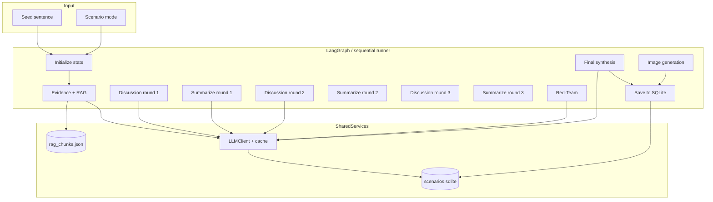
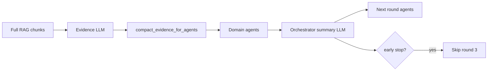

# Algorithm Specification — Cold War Scenario Simulator

**Purpose:** Interview-ready description of what the system does, how it was designed, how prompts and the LangGraph pipeline work, and what changes when you tune hyperparameters.

**Related docs:** [PIPELINE.md](PIPELINE.md) (flow), [PIPELINE_CODE_WALKTHROUGH.md](PIPELINE_CODE_WALKTHROUGH.md) (file/line map).

---

## 1. Problem statement (what you are solving)

**Input**

- A user **seed** (one sentence): a hypothetical shock, policy move, Taiwan event, tech restriction, etc.
- A **scenario mode**: `base_case` | `escalation` | `de_escalation` | `wildcard`

**Output**

- One **plausible** (not predictive) USA–China rivalry scenario for **2026–2031**
- Structured JSON: timeline with probabilities, agent summaries, disagreements, red-team critique, optional image
- Saved run in SQLite for replay

**Constraints the algorithm enforces**

1. **Strategic only** — no operational military tactics or harm-enabling detail (prompt-level + domain design).
2. **All agents always run** — no dynamic routing; reproducible portfolio demo.
3. **Bounded cost** — compaction, caching, optional early stop; no unbounded context growth across discussion rounds.
4. **Works offline** — mock mode without API key; RAG optional; empty KB safe.

---

## 2. High-level algorithm (one paragraph for interviews)

> The system is a **fixed-order multi-agent workflow** orchestrated by LangGraph (with a sequential fallback). A single shared **state object** carries the seed, evidence summary, per-agent outputs, and compressed discussion history. The **Evidence agent** retrieves local PDF/text chunks via TF-IDF, then every **domain agent** produces structured JSON assessments in up to **three discussion rounds**, each time seeing only a **compact** summary of the previous round—not full prior outputs. An **Orchestrator** compresses each round and later **synthesizes** a deduplicated timeline. A **Red-Team agent** challenges consensus. Finally, an **image prompt** is generated and optional illustration is saved. All LLM calls go through one wrapper with **SQLite caching**, **JSON schemas**, and **token budgets**.

---

## 3. Design philosophy (how the code was written)

These choices are intentional and good to mention in interviews.

| Principle | What we did | Why |
|---|---|---|
| **Separation of concerns** | `agents.py` = prompts + parsing; `graph.py` = orchestration; `llm.py` = API/cache; `rag.py` = retrieval | Easier to test, swap model, or change graph without touching prompts |
| **Schema-first I/O** | Pydantic models in `schemas.py`; agents return JSON coerced to `AgentOutput`, `EvidenceSummary`, etc. | Stable API contract; frontend and DB always get the same shape |
| **No agent calls OpenAI directly** | Everything via `LLMClient` | One place for retries, cache, mock mode, metrics |
| **Deterministic fallbacks** | Heuristic discussion summary, timeline merge, event-status classifier, mock JSON | Run never hard-fails on bad model output |
| **Fixed graph, no router** | 12 nodes in strict sequence | Simpler reasoning, easier to explain, meets “all agents every run” requirement |
| **Compression over raw context** | `cost_control.py` | Multi-round agents would otherwise blow token budget |
| **Config from `.env` only** | `config.py`; model never hard-coded | Hyperparameter tuning without code changes |
| **Portfolio-grade testability** | `pytest` + mock mode + temp SQLite in `conftest.py` | CI runs with zero API spend |

**What we deliberately did *not* do (and why)**

- No LangChain chains per agent — LangGraph for orchestration only; prompts are plain strings.
- No vector DB — TF-IDF + keyword fallback keeps MVP local and debuggable.
- No parallel agent execution in a round — sequential calls; simpler, predictable (trade-off: latency).
- No dynamic “skip agent if irrelevant” — clarity and demo reliability over marginal cost savings.

---

## 4. System architecture



---

## 5. Core data structure: `ScenarioState`

The algorithm is **state-passing**, not message-passing between arbitrary agents.

**State** (`app/schemas.py` — `ScenarioState`) is the single notebook updated by each graph node.

| Field | Role in algorithm |
|---|---|
| `seed`, `scenario_mode` | Fixed inputs for every agent call |
| `evidence_summary` | Written once by Evidence agent; all domain agents see **compressed** form only |
| `agent_outputs[name][]` | List per agent; index = discussion round (domain agents) or single entry (red_team) |
| `discussion_rounds[]` | Orchestrator-produced `DiscussionSummary` after each round |
| `final_timeline[]` | Deterministic merge of domain agents’ `timeline_contributions` |
| `red_team_findings[]` | Structured critique items |
| `run_metrics` | LLM calls, cache hits, retrieved docs, elapsed time |
| `_early_stopped` (internal) | Skip round 3 when consensus heuristic fires |

**Final output** = `build_final_scenario(state)` → `FinalScenario` JSON for API/UI.

---

## 6. LangGraph pipeline (detailed)

### 6.1 Graph topology

**Type:** Directed acyclic workflow (linear chain).  
**Implementation:** `app/graph.py` — `NODES` list + `build_graph()` using `langgraph.graph.StateGraph`.

```
N₁  orchestrator_initialize
N₂  evidence_rag_agent
N₃  discussion_round_1
N₄  orchestrator_summarize_round_1
N₅  discussion_round_2
N₆  orchestrator_summarize_round_2
N₇  discussion_round_3          ← may no-op if early_stop
N₈  orchestrator_summarize_round_3
N₉  red_team_agent
N₁₀ orchestrator_synthesis
N₁₁ orchestrator_image_generation
N₁₂ save_run
```

**No conditional edges in LangGraph** — early stopping is implemented *inside* node functions (`if _early_stopped: return state`).

### 6.2 Execution modes

| Mode | When | Behavior |
|---|---|---|
| **LangGraph** | `langgraph` import succeeds | `compiled.invoke(state_dict)` walks the chain |
| **Sequential fallback** | Import fails or invoke throws | `_run_sequential()` runs same 12 functions in a `for` loop |

Both produce identical logical results; tests often hit sequential path.

### 6.3 Per-node algorithms (pseudocode)

**N₁ — Initialize**

```
event_status ← classify_event_status(seed)     # keyword heuristics, no LLM
scenario_title ← "USA-China Scenario: " + truncate(seed)
agent_outputs[domain] ← [] for each domain agent
```

**N₂ — Evidence / RAG**

```
if USE_RAG:
    chunks ← retrieve_with_cache(seed, scenario_mode)   # TF-IDF top-K
else:
    chunks ← []
evidence_summary ← LLM_JSON(evidence_agent_prompt(seed, chunks))
state.evidence_summary ← evidence_summary
```

**N₃, N₅, N₇ — Discussion round *r***

```
if early_stopped: return
evidence_blob ← compact_evidence_for_agents(evidence_summary)
prev_summary ← discussion_rounds[-1] if r > 1 else None

for agent in [geo, economy, domestic, security, historical]:   # fixed order
    prev_self ← compact_agent_position(agent_outputs[agent][-1]) if exists
    out ← LLM_JSON(domain_prompt(seed, mode, evidence_blob, r, prev_summary, prev_self))
    agent_outputs[agent].append(out)

_latest_round_outputs ← outs of this round
```

**N₄, N₆, N₈ — Summarize round *r***

```
summary ← LLM_JSON(orchestrator_compress_prompt(latest_outputs))
discussion_rounds.append(summary)
if r ≥ 2 and should_stop_early(summary):
    early_stopped ← True
```

**Early-stop rule** (`cost_control.should_stop_early`):

```
stop ← (r ≥ 2) AND (|disagreements| ≤ 1) AND (|emerging_timeline| ≥ 3)
```

**N₉ — Red-Team**

```
out, findings ← LLM_JSON(red_team_prompt(seed, evidence_blob, last_discussion_summary))
```

**N₁₀ — Synthesis**

```
meta ← LLM_JSON(synthesis_prompt(all domain last outputs, red_team, evidence))
final_timeline ← build_final_timeline(domain_outputs)   # deterministic dedupe by year
scenario_title, summary, image_prompt ← meta
```

**Timeline merge algorithm** (`build_final_timeline`):

- For each year in {2026..2031}, collect `timeline_contributions` from all domain agents.
- Deduplicate events by normalized event text (first 80 chars).
- Year headline = highest `(probability, impact)` event.
- Domain tag mapped from agent name (e.g. `economy_technology` → `economy`).

**N₁₁ — Image**

```
if ENABLE_IMAGE_GENERATION:
    image ← OpenAI image API or mock placeholder
else: skip
```

**N₁₂ — Save**

```
final ← build_final_scenario(state)
SQLite INSERT scenario_runs
```

Post-graph: metrics filled, **second** save with complete `run_metrics`.

---

## 7. RAG algorithm

### 7.1 Offline ingestion

```
for each file in knowledge_base (*.md, *.txt, *.pdf):
    if pdf:
        text ← extract_pdf(path)                    # pypdf
        cache text → data/preprocessed/<name>.txt   # skip re-extract if PDF unchanged
    else:
        text ← read_utf8(path)
    chunks ← split(text, size=1200, overlap=150)
    tag source_type from path/filename (historical / strategy / current)
write all chunks → data/rag_chunks.json
```

Your corpus: **8 PDFs → ~3844 chunks** (after preprocessing).

### 7.2 Online retrieval (Evidence agent only)

```
query ← seed (+ scenario_mode hashed for cache key)
docs ← load rag_chunks.json
scores ← TF-IDF_cosine(query, doc_texts)  OR  keyword_overlap fallback
return top MAX_RETRIEVED_DOCS chunks with score > 0
```

**Important:** Domain agents never see raw chunks—only the Evidence agent’s **LLM-summarized** `EvidenceSummary.compact_summary`.

---

## 8. Prompt engineering spec

### 8.1 Prompt structure (every agent)

Each call uses a **two-message** pattern (OpenAI chat):

| Part | Content |
|---|---|
| **System** | Role + domain expertise + `SAFETY_TAIL` + `JSON_TAIL` |
| **User** | Seed + mode + compact context + round info + **explicit JSON schema** |

Global tails (`app/agents.py`):

- **`SAFETY_TAIL`** — strategic level only; no operational tactics; Taiwan agent: deterrence / gray-zone / de-escalation.
- **`JSON_TAIL`** — “Return ONLY a single JSON object… Be concise.”

LLM calls use `response_format: json_object` in live mode (`app/llm.py`).

### 8.2 Agent roles and prompt intent

| Agent | System prompt intent | User prompt includes |
|---|---|---|
| **Evidence / RAG** | Separate observed facts vs historical analogies vs frameworks vs **hypothetical** seed assumptions | Retrieved chunk blob (or `<none>`) |
| **Geo-Strategy** | Alliances, Indo-Pacific, grand strategy, third-country responses | Evidence blob + prev round summary + own prev position |
| **Economy & Technology** | Trade, chips, sanctions, supply chains, decoupling | Same |
| **Domestic & Ideology** | CCP legitimacy, nationalism, elite incentives | Same |
| **Security / Taiwan** | Deterrence, gray-zone, crisis stability — **explicit ban on tactics** | Same |
| **Historical Analogy** | USSR parallels, limits of analogy, US–China differences | Same |
| **Orchestrator (summary)** | Compress round; do not invent positions | Short bullet per agent position |
| **Orchestrator (final)** | One **plausible** scenario, not prediction; preserve disagreements | All domain assessments + red-team + evidence note |
| **Red-Team** | Challenge consensus, missing variables, overconfidence | Final discussion summary + evidence |

### 8.3 Structured output schema (domain agents)

Every domain agent must return:

```json
{
  "agent_name": "...",
  "round_number": 1,
  "main_assessment": "2-4 sentences",
  "key_drivers": ["..."],
  "timeline_contributions": [
    {"year": 2026, "event": "...", "probability": 0.4,
     "impact": "low|medium|high", "confidence": "low|medium|high", "rationale": "..."}
  ],
  "risks": [], "uncertainties": [],
  "agreements": [], "disagreements": [],
  "position_changed_from_previous_round": false
}
```

**Why JSON, not prose:** predictable parsing, smaller payloads, easier merge into timeline, cache-friendly.

### 8.4 Scenario mode (user-facing hyperparameter)

Mode is injected into every user prompt as `Scenario mode: <mode>`.

| Mode | Intended model behavior |
|---|---|
| `base_case` | Moderate, structurally driven evolution |
| `escalation` | Faster rivalry, sharper responses, higher tail risks |
| `de_escalation` | Guardrails, diplomacy, stabilization pathways |
| `wildcard` | Lower probability, higher surprise events |

The code does **not** use different temperatures per mode today—mode is **prompt-only**. (Possible future tuning: see §10.)

### 8.5 Parsing and failure handling

```
raw ← OpenAI
data ← extract_json(raw)          # strips fences, finds { ... }
if data is None:
    data ← fallback dict          # per-agent stub
return Pydantic model
```

Interview line: *“We treat the LLM as an unreliable serializer; the schema layer is the contract.”*

---

## 9. LLM call budget (typical run)

| Phase | Calls (live, 3 rounds, no cache) |
|---|---|
| Evidence | 1 |
| Domain agents | 5 × rounds_completed (5–15) |
| Round summaries | rounds_completed (1–3) |
| Red-Team | 1 |
| Final synthesis | 1 |
| **Total text** | **~15–21** |
| Image | 0–1 |

With **early stop after round 2:** ~13 text calls.  
With **cache hit** on repeated seed/mode/context: fewer billed calls, `cache_hits` increments.

---

## 10. Hyperparameters and tuning effects

All tunables live in `.env` (see `.env.example`). Below: what each knob does and **observable behavior** when you change it.

### 10.1 Model and API

| Parameter | Default | Turn up / change | Effect |
|---|---|---|---|
| `OPENAI_MODEL` | `gpt-5.4-mini` | Stronger model (e.g. larger GPT) | Richer reasoning, better JSON adherence, more nuanced disagreement; **higher cost & latency** |
| `OPENAI_API_KEY` | set | empty | **Mock mode** — deterministic stubs, no network; good for CI |
| `OPENAI_IMAGE_MODEL` | `gpt-image-2` | other image model | Different illustration style/quality |

**Temperature** (code-level today): `0.3` for JSON agents, `0.4` for text (`app/llm.py`). Not in `.env` yet.

| If you lower temperature (e.g. 0.1) | More repetitive, safer JSON; less creative wildcard scenarios |
| If you raise temperature (e.g. 0.7) | More diverse events; risk of schema drift or contradictions |

### 10.2 RAG

| Parameter | Default | Increase | Decrease / off |
|---|---|---|---|
| `USE_RAG` | `true` | — | `false` → Evidence agent runs with empty retrieval; seed-only reasoning |
| `MAX_RETRIEVED_DOCS` | `5` | 10–20 | More source material in Evidence prompt → richer citations, **longer Evidence call**, possible noise |
| | | 1–2 | Faster, narrower context; may miss relevant PDF sections |

**Chunking** (constants in `app/rag.py`, not env): `DEFAULT_CHUNK_CHARS=1200`, `OVERLAP=150`.

| Smaller chunks | Finer retrieval, more chunks file size, more precise citations |
| Larger chunks | More context per hit, blurrier boundaries |

**Re-ingest after KB changes:** `python scripts/ingest_docs.py`

### 10.3 Discussion loop

| Parameter | Default | Effect when changed |
|---|---|---|
| `MAX_AGENT_DISCUSSION_ROUNDS` | `3` | Set to `2` → graph skips round 3 node entirely (`graph.py` check). Set to `1` → no revision rounds (only initial positions + 1 summary) |

**Early stop** (not env-tunable; code in `cost_control.py`):

| Tighter stop (e.g. require 0 disagreements) | Fewer rounds, cheaper, may end before agents converge |
| Looser stop (never stop early) | Always 3 rounds, highest quality debate, highest cost |

### 10.4 Token / context budgets

| Parameter | Default | Increase | Decrease |
|---|---|---|---|
| `MAX_AGENT_INPUT_CHARS` | `6000` | Agents see more prior-round JSON → better continuity; **cost ↑** |
| `MAX_EVIDENCE_CHARS` | `2500` | More nuance from RAG summary; risk of drowning domain prompts |

Truncation is hard cut with `...` (`app/utils.py`).

### 10.5 Caching and features

| Parameter | Default | Effect |
|---|---|---|
| `USE_LLM_CACHE` | `true` | `false` → every identical agent+seed+round+context re-calls API; reproducibility still OK, cost ↑ |
| `ENABLE_IMAGE_GENERATION` | `true` | `false` → skip image API; faster runs |

Cache key = `hash(model, agent_name, round, system, user, cache_context)` — changing model invalidates cache logically (different hash).

### 10.6 Scenario mode (prompt-only today)

Tuning behavior without code changes: edit user-facing labels/descriptions in UI; mode string already alters every prompt.

**Future code tuning idea:** map mode → temperature or `max_agent_discussion_rounds` (e.g. escalation → 3 rounds, de_escalation → 2 + stricter early stop).

---

## 11. Cost-control algorithm (summary)



1. **Single RAG reader** — Evidence agent only.  
2. **Round compression** — Orchestrator summary replaces full transcripts.  
3. **Self-position only** — Each agent sees its own last output compressed, not other agents’ full JSON.  
4. **Structured short outputs** — JSON fields capped in parsing.  
5. **SQLite LLM cache** — Repeat demos cheap.  
6. **Early stop** — Heuristic after round 2.

---

## 12. Safety and product semantics

| Layer | Mechanism |
|---|---|
| Prompt | `SAFETY_TAIL` on all agents; Security agent extra constraints |
| Framing | Synthesis prompt: “PLAUSIBLE (not predicted)”; UI disclaimer |
| Image | Editorial, non-graphic prompt suffix; no tactical imagery |
| Output | Probabilities + confidence labels → epistemic humility |

**Interview line:** *“Safety is constraint-in-prompt plus schema, not a separate moderation API in the MVP.”*

---

## 13. Failure modes and resilience

| Failure | Behavior |
|---|---|
| Invalid JSON from model | `extract_json` → fallback dict → run continues |
| LangGraph invoke error | Fall back to `_run_sequential` |
| Image API failure | `image.error` set; scenario JSON still returned |
| Empty knowledge base | `retrieve()` → `[]`; Evidence labels seed hypothetical |
| PDF extract failure | File skipped; `skipped_files` in ingest stats |
| Node exception in sequential mode | Appended to `state.errors`; later nodes still run |

---

## 14. Interview talking points (cheat sheet)

**30-second pitch**

> “I built a multi-agent scenario planner: LangGraph orchestrates specialized analysts that debate over three rounds with compressed memory, RAG over PDF history books, structured JSON outputs, SQLite caching, and a red-team critic—producing a five-year US–China timeline from one seed sentence.”

**Why LangGraph?**

> “I needed explicit, testable control flow—all agents every time, ordered stages, shared state—not a black-box agent router. LangGraph gives a clear graph; we still keep prompts simple and own the state schema.”

**Why not one big prompt?**

> “Separation of expertise reduces single-model blind spots; discussion rounds surface disagreement; red-team mitigates overconfidence. Compression keeps cost manageable.”

**How do you control cost?**

> “Evidence-only RAG, round summarization, structured outputs, optional early stop, and deterministic cache keys in SQLite.”

**How do you evaluate quality?**

> “Schema validation, pytest end-to-end in mock mode, manual review of saved runs, run metrics (LLM calls, cache hits, retrieved docs). Future: golden seeds + human rubric.”

**What would you improve next?**

> Vector RAG, parallel domain agents, mode-specific temperatures, streaming SSE progress, human-in-the-loop edit of timeline, evaluation harness with fixed seed set.

---

## 15. Complexity summary

| Dimension | Order (typical) |
|---|---|
| LLM calls | O(rounds × domain_agents + rounds + constants) ≈ 15–21 |
| RAG retrieval | O(chunks) for TF-IDF fit per query |
| Timeline merge | O(agents × contributions × years) — small |
| Storage | O(1) per run insert; cache O(1) lookup per call |

**Bottleneck in production:** sequential LLM latency (not CPU).

---

## 16. Glossary

| Term | Meaning |
|---|---|
| **Seed** | User’s triggering sentence |
| **Scenario mode** | Lens applied to all prompts |
| **Node** | One step in the LangGraph pipeline |
| **Round** | One full pass of all five domain agents |
| **Discussion summary** | Orchestrator’s compressed view of a round |
| **Evidence summary** | RAG agent output fed to all domain agents |
| **Mock mode** | No API key; stub JSON responses |
| **Early stop** | Skip round 3 when disagreement is low |

---

*Document version: aligned with codebase including PDF RAG ingestion (`pypdf`, `data/preprocessed/`).*
