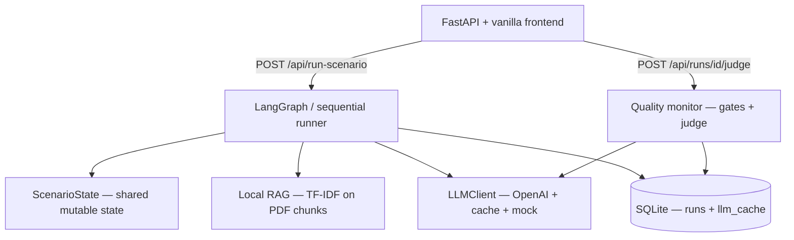

# Interview Story — Cold War Scenario Simulator

Use this doc to explain the project in system-design and agent interviews.
It is aligned with the **current codebase** (LangGraph, Tier 2 RAG, parallel
agents, orchestrator model split, quality monitor).

---

## 30-second pitch

> I built a **multi-agent scenario planner** for US–China rivalry (2026–2031).
> A user gives one **seed sentence**; a fixed LangGraph pipeline runs specialized
> analysts (geo, economy, security, history, etc.), they **debate in up to three
> rounds** with **compressed memory**, ground answers in a **local PDF knowledge
> base**, and an **Orchestrator** synthesizes a structured scenario. I focused on
> **cost control** (parallel domain agents, summaries, smaller model for most
> calls), **reliability** (Pydantic schemas, synthesis repair, safe fallbacks),
> and **quality monitoring** (hard gates + optional LLM-as-judge).

---

## Problem and design goals

| Goal | How the system addresses it |
|------|-----------------------------|
| Plausible scenarios, not predictions | Prompts + Orchestrator framing; `event_status` for hypothetical seeds |
| Specialist depth | Five domain agents with role-specific system prompts and RAG packets |
| Manageable cost/latency | Mini model for bulk agents; parallel round execution; compressed round memory |
| Grounding in books | Tier 2 RAG: per-agent retrieval, disagreement retrieval, citations |
| Production-ish robustness | Structured JSON, validation/repair, fallbacks, SQLite cache, mock mode for CI |
| Evaluability | Deterministic gates + LLM judge (not human rubric) |

---

## High-level architecture



**Layers (separation of concerns):**

| Layer | Module | Responsibility |
|-------|--------|----------------|
| API | `app/main.py` | HTTP, config exposure, trigger runs |
| Orchestration | `app/graph.py` | Fixed 13-step node pipeline |
| Agents | `app/agents.py` | Prompts + JSON schemas per role |
| LLM | `app/llm.py` | API calls, mock mode, per-agent model routing, cache |
| RAG | `app/rag.py`, `app/rag_citations.py` | Ingest PDFs, retrieve, evidence packets |
| Parallelism | `app/parallel_agents.py` | `RunnableParallel` for domain agents |
| Validation | `app/final_output_validation.py` | Final synthesis cleanup + repair |
| Monitor | `app/monitor/` | Hard gates + LLM-as-judge |
| Storage | `app/db.py` | Saved runs + LLM response cache |

LangGraph is used when available; otherwise the **same nodes** run in a simple
`for` loop — tests and demos do not depend on LangGraph internals.

---

## Pipeline (13 nodes)

```
1.  orchestrator_initialize     — classify seed, init state (no LLM)
2.  evidence_rag_agent          — baseline RAG + Evidence LLM
3.  discussion_round_1          — 5 domain agents (parallel)
4.  orchestrator_summarize_round_1
5.  disagreement_retrieval     — shared RAG for round 2 (no LLM)
6.  discussion_round_2          — 5 domain agents (parallel)
7.  orchestrator_summarize_round_2  — may trigger early stop
8.  discussion_round_3          — optional (config + early stop)
9.  orchestrator_summarize_round_3
10. red_team_agent              — critique + RAG
11. orchestrator_synthesis      — final narrative + timeline merge + validation
12. orchestrator_image_generation
13. save_run                    — SQLite
```

---

## Shared state (`ScenarioState`)

One object flows through all nodes:

| Field | Purpose |
|-------|---------|
| `seed`, `scenario_mode` | User input |
| `evidence_summary`, `evidence_lanes` | RAG output (structured + lane blobs) |
| `baseline_chunks`, `disagreement_chunks`, `red_team_chunks` | Retrieved chunk IDs |
| `agent_outputs` | Per-agent list of `AgentOutput` (one entry per round) |
| `discussion_rounds` | Orchestrator `DiscussionSummary` per round |
| `red_team_findings` | Structured critique |
| `final_timeline` | Merged deterministically from domain agents |
| `run_metrics` | LLM calls, RAG stats, synthesis validation, citations |
| `errors` | Non-fatal pipeline notes |

**Memory model:** Agents do **not** see full chat history. They see:

- Seed + mode (always)
- **Compressed** evidence packet (lanes + small chunk set)
- **Previous round summary** only (not other agents’ full JSON)
- **Own previous position** (one short paragraph)

The Orchestrator **compresses** each round so the next round stays within token budget.

---

## Every agent: role, model, inputs, outputs

### Model routing

| Agents | Model (typical) | Why |
|--------|-----------------|-----|
| Domain agents, Evidence, Red-Team | `OPENAI_MODEL` (e.g. `gpt-5.4-mini`) | High volume, structured JSON |
| Orchestrator summary, final synthesis, JSON repair | `OPENAI_ORCHESTRATOR_MODEL` (`gpt-5.4`) | Compression + synthesis quality |
| Quality judge | `OPENAI_JUDGE_MODEL` (`gpt-5.4`) | Independent scoring (optional) |

### Agent table

| Agent | LLM? | Primary inputs | Primary outputs |
|-------|------|----------------|-----------------|
| **Orchestrator init** | No | `seed` | `event_status`, placeholder title |
| **Evidence / RAG** | Yes | `seed`, `scenario_mode`, ~8 **baseline** PDF chunks | `EvidenceSummary` (facts, analogies, frameworks, hypothetical assumptions) |
| **Geo-Strategy** | Yes | Seed, mode, **evidence lanes** (geo + frameworks), **4 agent-specific chunks** (R1 only), round ≥2: prev summary + own position + **disagreement chunks** | `AgentOutput` + optional `sources_used`, `rag_influence` |
| **Economy & Technology** | Yes | Lanes: observed + economy + frameworks; R1 chunks tuned for trade/chips | Same |
| **Domestic / Ideology** | Yes | Lanes: observed + domestic + frameworks | Same |
| **Security / Taiwan** | Yes | Lanes: observed + security + frameworks | Same |
| **Historical Analogy** | Yes | Lanes: historical + frameworks; R1 chunks tuned for US–USSR / Cold War | Same |
| **Orchestrator summary** | Yes | Short bullets from **all 5 agents this round** | `DiscussionSummary` (agree/disagree/uncertainties/positions) |
| **Disagreement retrieval** | No | Last summary’s disagreements + uncertainties | `disagreement_chunks` (~4) |
| **Red-Team** | Yes | Seed, mode, evidence packet, **final** discussion summary, agent positions, **critique RAG chunks** | `AgentOutput` + `RedTeamFinding[]` |
| **Orchestrator final** | Yes | Seed, **FinalEvidencePacket**, agent assessments, red-team, last summary | Title, summary, assumptions, disagreements, image prompt |
| **Timeline merge** | No (code) | Last `timeline_contributions` per domain agent | `YearBlock[]` 2026–2031 |
| **JSON repair** | Yes (if needed) | Invalid synthesis JSON + schema errors | Repaired `OrchestratorSynthesisOutput` |
| **Quality judge** | Yes (optional) | Compact bundle from saved `FinalScenario` | `JudgeVerdict` (5 dimensions, 1–5) |

### Round-by-round input difference (domain agents)

| | Round 1 | Round 2+ |
|---|---------|----------|
| Per-agent RAG | Yes (~4 chunks) | No |
| Disagreement RAG | No | Yes (shared, from round 1 summary) |
| Prior discussion | None | Last `DiscussionSummary` |
| Own prior position | None | Compact text from last round |

Round 3 reuses disagreement evidence; **no new retrieval** by default.

---

## Tier 2 RAG (how books are used)

**Problem:** One shared RAG blob is too weak for specialists.

**Solution:**

1. **Baseline retrieval** at Evidence step (~8 chunks, broad query).
2. **Evidence lanes** — separate blobs (observed, historical, economy, security, …).
3. **Round 1:** each agent gets **lanes + 4 profile-specific chunks** (metadata filters + query suffix).
4. **After round 1:** **disagreement retrieval** from orchestrator summary (~4 shared chunks).
5. **Red-Team:** critique-focused retrieval.
6. **Final synthesis:** `FinalEvidencePacket` (capped list, not raw corpus).

**Citations:** Agents may cite only `chunk_id`s in their prompt; invalid IDs are stripped and logged in `run_metrics.citation_warnings`.

**Ingest:** 8 PDFs → ~3800 chunks in `data/rag_chunks.json`; domain inferred from path + text.

---

## Cost control (what to say in interviews)

### 1. Parallel domain agents

Within each discussion round, five domain agents run via LangChain
**`RunnableParallel`** (`PARALLEL_DOMAIN_AGENTS=true`). Same LLM cost, **~5×
lower wall-clock** per round vs sequential.

### 2. Compressed memory

- Orchestrator **summarizes** each round → next round sees ~1 page, not full JSON.
- Domain agents see **own** prior position as one paragraph, not full history.
- Evidence is **lane-limited** + top-K chunks, not whole books.

### 3. Cheaper model for bulk work

~15+ domain/evidence/red-team calls use **mini**; only **orchestrator + repair**
use the larger model (3–6 calls per run).

### 4. Early stop

After round 2, if disagreement is low and timeline is rich enough,
`should_stop_early()` skips round 3.

### 5. Caching

- **LLM cache** (SQLite): keyed by model + agent + prompt hash.
- **RAG cache** (in-process): keyed by seed + agent + query + filters.

### 6. Token caps

`MAX_AGENT_INPUT_CHARS`, `MAX_EVIDENCE_CHARS`, RAG `max_chunk_chars`,
`max_final_evidence_items` — all env-tunable.

### 7. Judge off critical path

Quality monitor runs **on demand** (`Run judge` button / CLI), not every simulation.

**Rough mental model:** Domain agents dominate **token spend**; orchestrator
dominates **quality-sensitive** steps; parallelism dominates **latency**.

---

## Fallbacks and reliability

| Failure | Behavior |
|---------|----------|
| No API key | **Mock mode** — deterministic JSON stubs; full graph runs in CI |
| Empty knowledge base | RAG returns `[]`; Evidence still runs |
| Invalid final synthesis JSON | `deterministic_cleanup` → Pydantic → **JSON repair agent** (≤2 tries) → **one regeneration** → **safe fallback** (image disabled, error in metrics) |
| Invalid agent citations | Strip bad `chunk_id`; warn in metrics; **run continues** |
| LangGraph error | Fall back to sequential node runner |
| Image API failure | Stored in `image.error`; run still saved |
| Judge failure | `judge_error` in monitor; gates still recorded |

**Principle:** Never crash the user run for a non-critical subsystem; surface
issues in `run_metrics` and `errors`.

---

## Quality monitoring

Two layers ([MONITOR.md](MONITOR.md)):

1. **Hard gates (free)** — timeline shape, synthesis fallback, validation pass,
   false-consensus warning, pipeline errors.
2. **LLM-as-judge (1 call)** — scores seed fidelity, plausibility, specialist
   diversity, disagreement preservation, timeline usefulness; failure-mode tags.

Stored on the run as `monitor` in SQLite; visible in the dashboard **Quality
monitor** panel.

---

## Final output contract

`FinalScenario` returned to the UI:

- Narrative: `scenario_title`, `scenario_summary`, `event_status`
- Structure: `timeline` (6 years), `main_disagreements`, `key_assumptions`
- Process: `discussion_summary`, `agent_summaries`, `red_team_warnings`
- Ops: `run_metrics`, optional `monitor`
- Media: `image` (optional PNG)

---

## Testing story

**82 pytest tests**, no OpenAI in CI:

- Graph end-to-end (mock)
- RAG ingest/retrieve, Tier 2 profiles, citations
- Parallel agents
- Final synthesis validation/repair
- Monitor gates + judge (mock)
- API JSON shape

This lets you say: *“I separated orchestration from agents from LLM so the
pipeline is testable without burning API credits.”*

---

## Interview Q&A cheat sheet

**Why multi-agent instead of one big prompt?**  
Specialists produce diverse structured views; disagreement is a feature. One
prompt tends to average everything into generic “Cold War 2.0” prose.

**Why Orchestrator separate from domain agents?**  
Domain agents generate; Orchestrator **compresses** and **synthesizes** without
re-reading the whole corpus each time.

**Why not agentic routing?**  
Fixed graph is **predictable, testable, and cheaper** for a portfolio MVP. Every
agent always runs; no runaway tool loops.

**How do agents disagree if they don’t see each other?**  
Same seed, different roles → different drivers. Round 2 adds explicit
disagreement summary + disagreement RAG.

**Biggest cost lever?**  
Parallel mini-model domain rounds + round summarization + not judging every run.

**Biggest quality lever?**  
Orchestrator on stronger model + Tier 2 RAG + synthesis validation + optional judge.

**What would you add next?**  
Golden seed regression with judge scores; embedding RAG if TF-IDF misses semantics;
SSE progress for long runs.

---

## One-line closers (pick one)

- *“It’s a fixed-order multi-agent workflow with compressed debate memory, targeted RAG, and orchestrator-only strong-model synthesis.”*
- *“I optimized for cost at the domain layer and quality at the synthesis layer.”*
- *“Every agent returns Pydantic JSON; the graph owns state; monitoring is gates plus one judge call.”*

---

## Related docs

- [PIPELINE.md](PIPELINE.md) — flow diagrams  
- [ALGO_SPEC.md](ALGO_SPEC.md) — hyperparameters and tuning  
- [MONITOR.md](MONITOR.md) — quality monitor MVP  
- [README.md](../README.md) — how to run locally  
