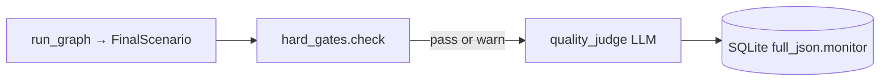

# Quality Monitor (MVP) — LLM-as-Judge

A **small** monitor on top of what you already have. No human rubric, no large
eval platform. Two layers only: **hard gates** (free) + **one judge call** (live).

---

## Design principle

```
pytest + Pydantic  →  "Did the machine work?"
run_metrics        →  "Did the pipeline stay healthy?"
LLM judge (1×)     →  "Is the scenario strategically usable?"
```

Do not re-score structure the judge can infer. Reuse `FinalScenario` and
`RunMetrics` as the judge input bundle.

---

## Architecture



**Not inline by default.** Judge runs on demand (`scripts/judge_run.py`) or via
`POST /api/runs/{run_id}/judge` so normal simulations stay fast/cheap.

---

## Layer 1 — Hard gates (deterministic, no LLM)

Reuse existing validators and metrics. One function
`app/monitor/gates.py::check_hard_gates(final: FinalScenario) -> GateReport`.

| Gate ID | Source already in repo | Fail if |
|---------|------------------------|---------|
| G1 | `FinalScenario` + `test_graph` shape | Timeline ≠ 6 years or missing title/summary |
| G2 | `run_metrics.synthesis_used_fallback` | `true` |
| G3 | `run_metrics.synthesis_validation_passed` | `false` |
| G4 | `run_metrics.errors` / node failures | Non-empty critical errors |
| G5 | `main_disagreements` + last `discussion_summary` | Both empty (false consensus) |
| G6 | `test_final_output_validation` rules | Re-run `validate_orchestrator_synthesis` on stored title/summary fields if needed |

`GateReport`: `{ passed: bool, blockers: [], warnings: [] }`.

**Blockers** skip judge (save API cost). **Warnings** still allow judge.

This layer is unit-testable exactly like `test_final_output_validation.py` —
mock `FinalScenario` dicts, no OpenAI.

---

## Layer 2 — LLM-as-judge (one JSON call)

### Input bundle (compact, ~2–4k tokens)

Built from `FinalScenario.model_dump()` — **not** raw RAG chunks:

```json
{
  "seed": "...",
  "scenario_mode": "...",
  "scenario_title": "...",
  "scenario_summary": "...",
  "event_status": "...",
  "main_disagreements": [],
  "key_assumptions": [],
  "red_team_warnings": [],
  "agent_summaries": { "geo_strategy": "...", ... },
  "last_discussion": { "areas_of_disagreement": [], "key_uncertainties": [] },
  "timeline_headlines": ["2026: ...", "2027: ..."],
  "pipeline": {
    "synthesis_used_fallback": false,
    "citation_warnings": [],
    "unique_chunks_used": 3
  }
}
```

Strip image prompts and full timeline event lists (headlines only).

### Judge model

| Env | Suggested |
|-----|-----------|
| `OPENAI_JUDGE_MODEL` | `gpt-5.4` (default = orchestrator model) |

Use `LLMClient` with `agent_name="quality_judge"`. Cache keyed like other agents.

**Rule:** Judge evaluates **final artifact + agent summaries**, not orchestrator
chain-of-thought. Same model family as orchestrator is OK because input is
downstream output, not the synthesis prompt.

### Output schema (`JudgeVerdict` — Pydantic)

```python
class JudgeDimension(BaseModel):
    name: str
    score: int = Field(ge=1, le=5)
    rationale: str = Field(max_length=300)

class JudgeVerdict(BaseModel):
    overall_score: float = Field(ge=1.0, le=5.0)
    pass_quality_bar: bool  # overall >= 3.5 AND no dimension == 1
    dimensions: List[JudgeDimension]  # exactly 5
    failure_modes: List[str] = []     # from fixed enum list
    one_line_verdict: str = Field(max_length=200)
```

**Five dimensions only** (keeps prompt stable):

1. `seed_fidelity` — scenario follows the seed
2. `plausibility` — reads as plausible scenario, not prediction
3. `specialist_diversity` — agents sound distinct, not clones
4. `disagreement_preservation` — tensions not flattened
5. `timeline_usefulness` — 2026–2031 arc is coherent

**Failure mode enum** (judge picks from list, like your citation warnings):

`false_consensus`, `seed_drift`, `economic_monoculture`, `weak_red_team`,
`generic_cold_war`, `overconfident_timeline`, `ignored_hypothetical_seed`

Validate with Pydantic; on invalid JSON → one repair call (same pattern as
`orchestrator_json_repair`) or store `judge_error` only.

---

## Storage

Attach to saved run (minimal schema change):

```json
"monitor": {
  "gates": { "passed": true, "blockers": [], "warnings": ["G5"] },
  "judge": { "overall_score": 4.1, "pass_quality_bar": true, ... },
  "judged_at": "ISO8601",
  "judge_model": "gpt-5.4"
}
```

No new table required — nest under `full_json` in `scenario_runs`.

---

## How it reuses existing tests

| Existing test module | Monitor use |
|---------------------|-------------|
| `test_graph.py` | Gate G1 contract (6-year timeline, agents ran) |
| `test_final_output_validation.py` | Gate G2/G3 patterns; judge repair mirrors synthesis repair |
| `test_schemas.py` | `JudgeVerdict` validation tests (mock, no API) |
| `test_tier2_rag.py` | Pipeline block in judge input (`citation_warnings`) |
| `test_api.py` | Extend with `GET /api/runs/{id}` includes `monitor` when present |

**New tests (small):**

- `tests/test_monitor_gates.py` — 6–8 cases on fixture `FinalScenario` dicts
- `tests/test_monitor_judge.py` — mock `quality_judge` LLM response → Pydantic pass

---

## Operations (small surface)

| Command | Purpose |
|---------|---------|
| `python scripts/judge_run.py <run_id>` | Judge one saved run |
| `python scripts/judge_run.py --last 5` | Judge last N runs from SQLite |
| `ENABLE_RUN_JUDGE=true` (optional) | Auto-judge after save (off by default) |

**Golden smoke (3 seeds only):**

`eval/smoke_seeds.json` — taiwan, chip_controls, trade_restart.

`python scripts/smoke_monitor.py` → run graph + gates + judge → print table.

No weekly human review, no Tier D/E from EVALUATION.md.

---

## Cost / latency

| Step | Typical cost |
|------|----------------|
| Hard gates | 0 |
| Judge | 1 × gpt-5.4 call (~2–4k in / ~500 out) |
| Full simulation | unchanged (judge off critical path) |

**Trade-off:** Run judge on **saved runs you care about**, not every click.

---

## What we explicitly skip (for now)

- Human rubric
- Deterministic diversity/Jaccard scoring
- Per-agent judging (5 extra calls)
- Embedding similarity to knowledge base
- Full golden regression dashboard

Add only when judge failure modes show a **repeatable** gap (e.g. 80% `economic_monoculture`).

---

## Implementation status

| Piece | Location |
|-------|----------|
| Hard gates | `app/monitor/gates.py` |
| LLM judge | `app/monitor/judge.py` |
| Persist + API | `app/monitor/service.py`, `POST /api/runs/{run_id}/judge` |
| CLI | `scripts/judge_run.py` |
| Dashboard | **Quality monitor** panel + **Run judge** button |
| Tests | `tests/test_monitor_gates.py`, `tests/test_monitor_judge.py` |

Env: `OPENAI_JUDGE_MODEL=gpt-5.4`, `ENABLE_RUN_JUDGE=false` (auto-judge after save if `true`).

---

*Supersedes the large multi-tier plan in [EVALUATION.md](EVALUATION.md) for day-to-day use.
Keep EVALUATION.md as background reading only.*
