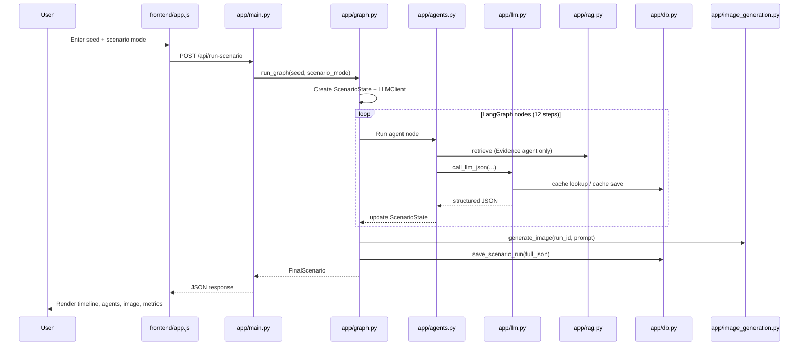
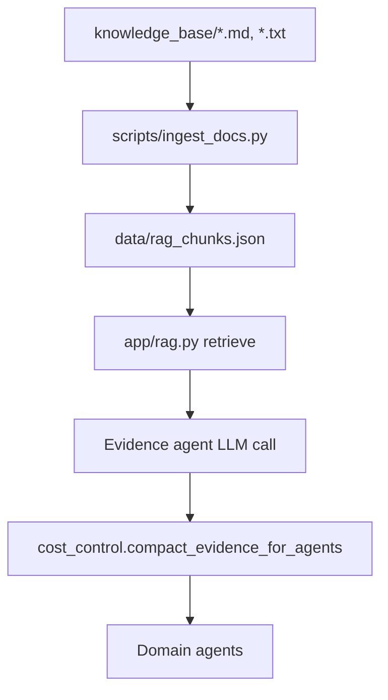

# Cold War Scenario Simulator — Pipeline Guide

This document explains **how data flows through the app**, from the moment a user clicks **Run Simulation** until the final JSON is saved and displayed. Use it as a map when reading the code.

---

## 1. Big picture

The app has three layers:

| Layer | Role | Key files |
|---|---|---|
| **Frontend** | Collects seed + mode, calls API, renders results | `frontend/index.html`, `style.css`, `app.js` |
| **API** | HTTP entry point, serves static files | `app/main.py` |
| **Agent pipeline** | Multi-agent LangGraph workflow | `app/graph.py`, `app/agents.py`, `app/llm.py` |

Supporting systems sit underneath the pipeline:

- **Config** — reads `.env` (`app/config.py`)
- **RAG** — local document retrieval (`app/rag.py`, `scripts/ingest_docs.py`)
- **LLM wrapper** — OpenAI calls + mock mode + cache (`app/llm.py`)
- **Cost control** — compacts prompts between rounds (`app/cost_control.py`)
- **Storage** — SQLite for runs and LLM cache (`app/db.py`)
- **Image generation** — final illustration (`app/image_generation.py`)
- **Schemas** — typed state and output shapes (`app/schemas.py`)

---

## 2. End-to-end flow (one request)



**In plain language:**

1. User submits a seed sentence and a scenario mode.
2. FastAPI validates the input and calls `run_graph()`.
3. A **LangGraph** (or sequential fallback) runs **12 nodes** in order.
4. Each agent calls the **LLM wrapper**, which may hit **SQLite cache** or **OpenAI**.
5. Only the **Evidence agent** talks to **RAG**.
6. Domain agents discuss for up to **3 rounds**, with the Orchestrator compressing each round.
7. Red-Team critiques the result; Orchestrator synthesizes a **2026–2031 timeline**.
8. An image is generated (or mocked); everything is saved to SQLite.
9. JSON goes back to the browser and is rendered.

---

## 3. Entry point: API layer

**File:** `app/main.py`

When the server starts, `db.init_db()` creates two SQLite tables:

- `scenario_runs` — full scenario JSON per run
- `llm_cache` — cached LLM responses

The main simulation endpoint:

```
POST /api/run-scenario
Body: { "seed": "...", "scenario_mode": "base_case" }
```

```python
# app/main.py (simplified)
def run_scenario(req: ScenarioRequest):
    final = run_graph(seed=req.seed.strip(), scenario_mode=req.scenario_mode)
    return final.model_dump()
```

Other useful endpoints:

| Endpoint | Purpose |
|---|---|
| `GET /` | Serves the dashboard |
| `GET /api/config` | Public config (model name, mock mode, flags) |
| `GET /api/runs` | List saved runs |
| `GET /api/runs/{run_id}` | Load one saved run |
| `POST /api/ingest` | Re-ingest `knowledge_base/` into RAG chunks |
| `GET /generated_images/{file}` | Serve generated PNGs |

---

## 4. The graph: 12 nodes in order

**File:** `app/graph.py`

The pipeline is a **fixed sequence** — there is no dynamic routing. Every agent runs on every simulation.

```
START
  │
  ▼
① orchestrator_initialize
  │
  ▼
② evidence_rag_agent
  │
  ▼
③ discussion_round_1          ──► 5 domain agents (sequential)
  │
  ▼
④ orchestrator_summarize_round_1
  │
  ▼
⑤ discussion_round_2          ──► 5 domain agents revise
  │
  ▼
⑥ orchestrator_summarize_round_2   (may set early_stop flag)
  │
  ▼
⑦ discussion_round_3          ──► 5 domain agents final input
  │
  ▼
⑧ orchestrator_summarize_round_3
  │
  ▼
⑨ red_team_agent
  │
  ▼
⑩ orchestrator_synthesis
  │
  ▼
⑪ orchestrator_image_generation
  │
  ▼
⑫ save_run
  │
  ▼
END
```

### What each node does

| # | Node | File / function | What it does |
|---|---|---|---|
| ① | `orchestrator_initialize` | `graph.orchestrator_initialize` | Classifies seed as observed/hypothetical/mixed; sets title; prepares empty agent output slots |
| ② | `evidence_rag_agent` | `agents.run_evidence_agent` | Retrieves RAG chunks; LLM separates facts vs analogies vs hypothetical assumptions |
| ③⑤⑦ | `discussion_round_N` | `graph._run_discussion_round` | Runs all 5 domain agents for round N |
| ④⑥⑧ | `orchestrator_summarize_round_N` | `agents.run_orchestrator_summary` | Compresses round into a `DiscussionSummary`; may trigger early stop after round 2 |
| ⑨ | `red_team_agent` | `agents.run_red_team_agent` | Challenges assumptions; returns findings |
| ⑩ | `orchestrator_synthesis` | `agents.run_orchestrator_final_synthesis` + `build_final_timeline` | Merges agent outputs into title, summary, timeline, image prompt |
| ⑪ | `orchestrator_image_generation` | `image_generation.generate_image` | Calls OpenAI image API; saves PNG; never crashes on failure |
| ⑫ | `save_run` | `db.save_scenario_run` | Writes full JSON to SQLite |

**LangGraph vs fallback:** `build_graph()` tries to compile a LangGraph `StateGraph`. If that fails, `_run_sequential()` runs the same 12 functions in a simple `for` loop. Both paths produce the same result.

---

## 5. Shared state: `ScenarioState`

**File:** `app/schemas.py`

Every graph node receives and returns a `ScenarioState` object. Think of it as the **notebook** passed between agents.

Important fields:

```
ScenarioState
├── run_id                  # unique ID, e.g. run_abc123
├── seed                    # user's input sentence
├── scenario_mode           # base_case | escalation | de_escalation | wildcard
├── event_status            # observed | hypothetical | mixed
├── evidence_summary        # compact RAG output (EvidenceSummary)
├── discussion_rounds[]     # list of DiscussionSummary (one per round)
├── agent_outputs{}         # dict: agent_name → list of AgentOutput (one per round)
├── red_team_findings[]     # list of RedTeamFinding
├── final_timeline[]        # list of YearBlock (2026–2031)
├── scenario_title
├── scenario_summary
├── image_prompt
├── image_result            # path / error / mock flag
├── run_metrics             # llm_calls, cache_hits, elapsed, etc.
└── errors[]                # non-fatal failures collected here
```

At the end, `build_final_scenario(state)` converts `ScenarioState` into `FinalScenario` — the JSON the frontend receives.

---

## 6. The five domain agents

**File:** `app/agents.py`

These agents run in **every discussion round** (rounds 1–3). They run **sequentially** inside each round (not in parallel).

| Agent key | Focus |
|---|---|
| `geo_strategy` | Alliances, Indo-Pacific strategy, diplomacy, balance of power |
| `economy_technology` | Trade, chips, sanctions, supply chains, decoupling |
| `domestic_ideology` | US/China domestic politics, nationalism, CCP legitimacy |
| `security_taiwan` | Taiwan risk, deterrence, gray-zone pressure (no operational tactics) |
| `historical_analogy` | Cold War parallels, useful vs misleading analogies |

Each agent returns an `AgentOutput`:

```json
{
  "agent_name": "geo_strategy",
  "round_number": 1,
  "main_assessment": "...",
  "key_drivers": ["..."],
  "timeline_contributions": [
    { "year": 2026, "event": "...", "probability": 0.4,
      "impact": "medium", "confidence": "medium", "rationale": "..." }
  ],
  "risks": ["..."],
  "uncertainties": ["..."],
  "agreements": ["..."],
  "disagreements": ["..."],
  "position_changed_from_previous_round": false
}
```

### What each agent sees in its prompt

Agents do **not** see everything. Each round they receive only:

1. The original **seed**
2. The **scenario mode**
3. A **compact evidence summary** (not raw RAG documents)
4. The **previous round's discussion summary** (not all prior full outputs)
5. Their **own previous position** (one short paragraph)
6. A strict **JSON output schema**

This is enforced in `agents.run_domain_agent()` and truncated by `MAX_AGENT_INPUT_CHARS` from `.env`.

---

## 7. Discussion loop (rounds 1 → 3)

```mermaid
flowchart LR
    subgraph Round1["Round 1 — independent assessments"]
        A1[geo_strategy]
        A2[economy_technology]
        A3[domestic_ideology]
        A4[security_taiwan]
        A5[historical_analogy]
    end

    S1[Orchestrator summarizes round 1]

    subgraph Round2["Round 2 — revise or defend"]
        B1[geo_strategy]
        B2[economy_technology]
        B3[domestic_ideology]
        B4[security_taiwan]
        B5[historical_analogy]
    end

    S2[Orchestrator summarizes round 2]
    ES{Early stop?}
    R3[Round 3 optional]

    Round1 --> S1 --> Round2 --> S2 --> ES
    ES -->|No| R3
    ES -->|Yes| RT[Red-Team]
    R3 --> RT
```



**Round 1:** Each agent gives an independent assessment with no prior discussion context.

**Round 2:** Each agent sees the round-1 summary and can revise or defend its position.

**Round 3:** Same pattern using the round-2 summary.

**Early stopping** (`cost_control.should_stop_early`): After round 2, if there is at most one major disagreement and the emerging timeline looks coherent, the graph sets `_early_stopped = True` and skips round 3. This is an optimization, not a requirement.

**Discussion summary shape** (produced by Orchestrator after each round):

```json
{
  "round_number": 1,
  "areas_of_agreement": ["..."],
  "areas_of_disagreement": ["..."],
  "emerging_timeline": ["2026: ...", "2028: ..."],
  "key_uncertainties": ["..."],
  "agent_positions": {
    "geo_strategy": "...",
    "economy_technology": "..."
  }
}
```

---

## 8. Evidence / RAG pipeline

RAG runs **once**, inside node ②. No other agent reads raw documents.



### Ingestion (offline, before or during dev)

```
python scripts/ingest_docs.py
```

- Reads `.md` and `.txt` from `knowledge_base/`
- Splits into ~1200-char chunks with overlap
- Tags each chunk with `source_type` (from folder/filename) and `domain`
- Writes `data/rag_chunks.json`

### Retrieval (at runtime)

- Query = user's seed + scenario mode
- Scoring: **TF-IDF cosine similarity** (scikit-learn), or keyword overlap fallback
- Returns top `MAX_RETRIEVED_DOCS` chunks (default 5)
- Results are cached in memory keyed by `hash(seed + scenario_mode)`

### Empty knowledge base

If `knowledge_base/` is empty:

- `retrieve()` returns `[]`
- Evidence agent still runs
- It labels the seed as a **hypothetical assumption**
- The app does **not** crash

---

## 9. LLM layer

**File:** `app/llm.py`

Every agent calls the LLM through `LLMClient`. Agents never import OpenAI directly.

```
call_llm_json(system_prompt, user_prompt, agent_name, ...)
        │
        ▼
   Cache lookup?  ──hit──► return cached JSON
        │ miss
        ▼
   mock_mode?     ──yes──► return deterministic stub JSON
        │ no
        ▼
   OpenAI API     ──► parse JSON ──► save to cache ──► return
```

### Mock mode

If `OPENAI_API_KEY` is empty in `.env`, `CONFIG.mock_mode` is `True`. The app returns schema-faithful stub responses so the full pipeline runs without network access. All tests use this mode.

### Cache

- **Key:** `hash(model + agent_name + round + system + user + context)`
- **Storage:** SQLite table `llm_cache`
- **Toggle:** `USE_LLM_CACHE=true` in `.env`

### Model selection

The model is read from `.env` only — never hard-coded:

```
OPENAI_MODEL=gpt-5.4-mini
```

---

## 10. Red-Team and final synthesis

### Red-Team (node ⑨)

Runs **after** all discussion rounds. It receives:

- Seed + mode
- Compact evidence
- Final discussion summary

It returns structured findings (contradictions, missing variables, overconfident assumptions) stored in `state.red_team_findings`.

### Final synthesis (node ⑩)

Two steps happen here:

1. **LLM synthesis** (`run_orchestrator_final_synthesis`) — produces title, summary, event status, disagreements, image prompt.
2. **Deterministic timeline merge** (`build_final_timeline`) — collects all domain agents' `timeline_contributions`, deduplicates events, groups them into year blocks for 2026–2031.

The Orchestrator explicitly frames output as **"one plausible scenario"**, not a prediction.

---

## 11. Image generation

**File:** `app/image_generation.py`

After synthesis, node ⑪:

1. Uses the LLM-generated `image_prompt` (or builds a safe default)
2. If `ENABLE_IMAGE_GENERATION=true`, calls `OPENAI_IMAGE_MODEL`
3. Saves PNG to `data/generated_images/<run_id>.png`
4. On failure: stores error in `image_result.error` — **does not crash the run**

Image prompts enforce a non-graphic, editorial style (no tactical detail).

---

## 12. Storage

**File:** `app/db.py`

### `scenario_runs` table

| Column | Content |
|---|---|
| `run_id` | Primary key |
| `created_at` | ISO timestamp |
| `seed` | User input |
| `scenario_mode` | base_case / escalation / etc. |
| `scenario_title` | Short title for the sidebar |
| `full_json` | Complete `FinalScenario` as JSON string |

The run is saved **twice**: once inside node ⑫ and once at the end of `run_graph()` (with final metrics filled in).

### `llm_cache` table

Stores cached LLM responses keyed by hash. Speeds up repeated runs with the same seed/context.

---

## 13. Cost-control techniques

**File:** `app/cost_control.py`

| Technique | Where | Effect |
|---|---|---|
| Shared evidence summary | `compact_evidence_for_agents()` | Domain agents never see raw RAG chunks |
| Round compression | `run_orchestrator_summary()` | Next round sees a summary, not full prior outputs |
| Position compression | `compact_agent_position()` | Agent sees its own prior output as one short line |
| Input truncation | `MAX_AGENT_INPUT_CHARS`, `MAX_EVIDENCE_CHARS` | Hard caps on prompt size |
| Early stopping | `should_stop_early()` | Skip round 3 when consensus is strong |
| LLM cache | `llm.py` + SQLite | Reuse identical agent calls |
| Retrieval cache | `rag.py` | Reuse identical RAG queries per process |
| Structured JSON outputs | All agents | Short responses, not essays |

---

## 14. Frontend flow

**Files:** `frontend/index.html`, `style.css`, `app.js`

1. Page loads → fetches `/api/config` (shows model name) and `/api/runs` (sidebar)
2. User enters seed, picks mode, clicks **Run Simulation**
3. `app.js` sends `POST /api/run-scenario`
4. While waiting, animates the 9-step progress list (optimistic UI — the backend is one blocking call)
5. On success, `renderResult(data)` fills:
   - Scenario title, summary, event-status badge
   - Timeline cards (2026–2031)
   - Discussion rounds, agent summaries, disagreements, red-team warnings
   - Generated image (from `/generated_images/<run_id>.png`)
   - Run metrics
6. Clicking a saved run in the sidebar loads it via `GET /api/runs/{run_id}`

---

## 15. Configuration (.env)

**File:** `app/config.py` (loaded at import via `python-dotenv`)

| Variable | Default | Purpose |
|---|---|---|
| `OPENAI_API_KEY` | empty | Empty = mock mode |
| `OPENAI_MODEL` | gpt-5.4-mini | Text model for all agents |
| `OPENAI_IMAGE_MODEL` | gpt-image-2 | Image generation model |
| `USE_RAG` | true | Enable local retrieval |
| `USE_LLM_CACHE` | true | Enable SQLite LLM cache |
| `ENABLE_IMAGE_GENERATION` | true | Generate illustration |
| `MAX_AGENT_DISCUSSION_ROUNDS` | 3 | Max discussion rounds |
| `MAX_RETRIEVED_DOCS` | 5 | RAG top-K |
| `MAX_AGENT_INPUT_CHARS` | 6000 | Prompt size cap per agent |
| `MAX_EVIDENCE_CHARS` | 2500 | Evidence summary cap |
| `SQLITE_PATH` | data/scenarios.sqlite | Database file |
| `RAG_CHUNKS_PATH` | data/rag_chunks.json | RAG index file |
| `GENERATED_IMAGES_DIR` | data/generated_images | Image output folder |

Copy `.env.example` to `.env` and fill in your API key for live mode.

---

## 16. How to trace one request in the code

Follow this path when debugging:

```
frontend/app.js
  runScenario()
    fetch POST /api/run-scenario

app/main.py
  run_scenario()
    run_graph(seed, scenario_mode)

app/graph.py
  run_graph()
    ScenarioState created
    build_graph().invoke()  OR  _run_sequential()
      for each node in NODES:
        orchestrator_initialize      → agents.classify_event_status
        evidence_rag_agent           → agents.run_evidence_agent
                                       → rag.retrieve_with_cache
                                       → llm.call_llm_json
        discussion_round_1             → agents.run_domain_agent × 5
        orchestrator_summarize_round_1 → agents.run_orchestrator_summary
        ... (rounds 2–3) ...
        red_team_agent               → agents.run_red_team_agent
        orchestrator_synthesis       → agents.run_orchestrator_final_synthesis
                                       → agents.build_final_timeline
        orchestrator_image_generation → image_generation.generate_image
        save_run                     → db.save_scenario_run
    build_final_scenario()
    db.save_scenario_run()  (with metrics)
    return FinalScenario

app/main.py
  return final.model_dump()

frontend/app.js
  renderResult(data)
```

---

## 17. Module dependency map

```
main.py
 └── graph.py
      ├── agents.py
      │    ├── llm.py ──► db.py (cache)
      │    ├── rag.py
      │    └── cost_control.py
      ├── image_generation.py
      ├── db.py
      └── schemas.py

config.py  ◄── read by all modules
utils.py   ◄── hashing, JSON parsing, IDs
```

---

## 18. Tests mirror the pipeline

**Folder:** `tests/`

| Test file | What it verifies in the pipeline |
|---|---|
| `test_config.py` | `.env` loading, mock mode detection |
| `test_schemas.py` | State/output validation |
| `test_rag.py` | Empty KB, ingest, retrieve, cache |
| `test_llm.py` | Mock mode, cache keys, JSON fallback |
| `test_agents.py` | Each agent returns required fields |
| `test_graph.py` | Full end-to-end run, 2026–2031 timeline |
| `test_db.py` | Save/load runs and cache |
| `test_api.py` | HTTP endpoints |
| `test_image_generation.py` | Mock image, failure tolerance |

All tests run in **mock mode** with an isolated temp database (`tests/conftest.py`). No OpenAI calls are made.

Run them with:

```bash
pytest
```

---

## 19. Quick glossary

| Term | Meaning |
|---|---|
| **Seed** | The user's one-sentence scenario trigger |
| **Scenario mode** | Lens: base_case, escalation, de_escalation, wildcard |
| **Node** | One step in the LangGraph pipeline |
| **Round** | One pass where all 5 domain agents speak |
| **Discussion summary** | Orchestrator's compressed view of a round |
| **Evidence summary** | RAG agent's compact context for all other agents |
| **Mock mode** | No API key → deterministic stub responses |
| **FinalScenario** | The JSON returned to the frontend and saved to DB |

---

## 20. Related docs

- [README.md](../README.md) — setup, architecture overview, example run link
- [.env.example](../.env.example) — all configuration variables
- [examples/example_scenario.html](../examples/example_scenario.html) — static demo of one real run
